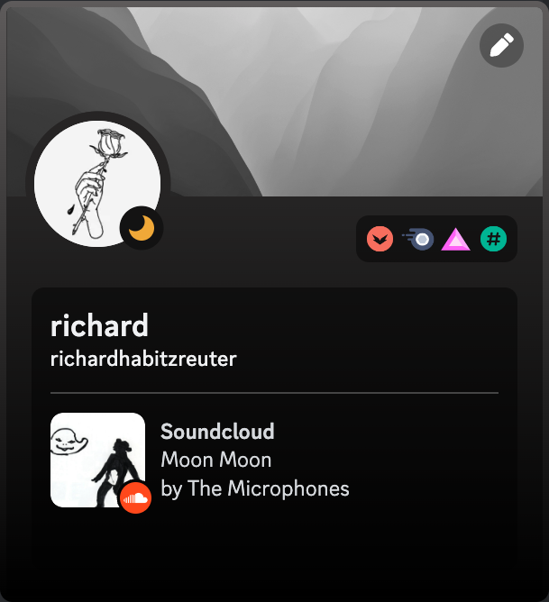

# soundcloud-rpc - a SoundCloud Client with Discord Rich Presence, Dark Mode, Last.fm and AdBlock support

## Preview

## Installation

### Release
For the latest version of soundcloud-rpc, download the installer or executable file from the [latest release](https://github.com/richardhbtz/soundcloud-rpc/releases) page.

### Manual

Before installing and running this app, you must have [Node.js](https://nodejs.org/) installed on your machine. 

1. Clone this repository to your local machine
2. Run `npm install` to install the required dependencies.
3. Run `npm start` to launch the application.

## Configuration

- The application settings are stored locally using Electron's `electron-store` module.
- Dark mode and adblocker settings can be toggled using keybinds.
- Last.fm automatic track scrobbling can be enabled through keybinds and registering your API keys.

## Keybinds

| Keybinding              | Description                                                            |
| ----------------------- | ---------------------------------------------------------------------- |
| F1                      | Toggles dark mode                                                      |
| F2                      | Toggles adblocker                                                      |
| F3                      | Shows the proxy config window                                          |
| F4                      | Insert last.fm api keys for scrobbling functionality                   |
| Shift + F4              | Reset last.fm keys in case of errors                                   |
| Ctrl + B or Command + B | Goes back to the previous web page                                     |
| Ctrl + F or Command + F | Goes forward a web page                                                |

## Credits

- The Discord Rich Presence integration is implemented using the [discord-rpc](https://www.npmjs.com/package/discord-rpc) package.
- The Electron window is created using the [Electron](https://www.electronjs.org/) framework.
- The executable is packed using [electron-builder](https://www.electron.build/).

## Contributing

Contributions to this project are welcome. If you find a bug or would like to suggest a new feature, please open an issue on this repository.

## License

This project is licensed under the MIT License. See the [LICENSE](./LICENSE) file for details.
