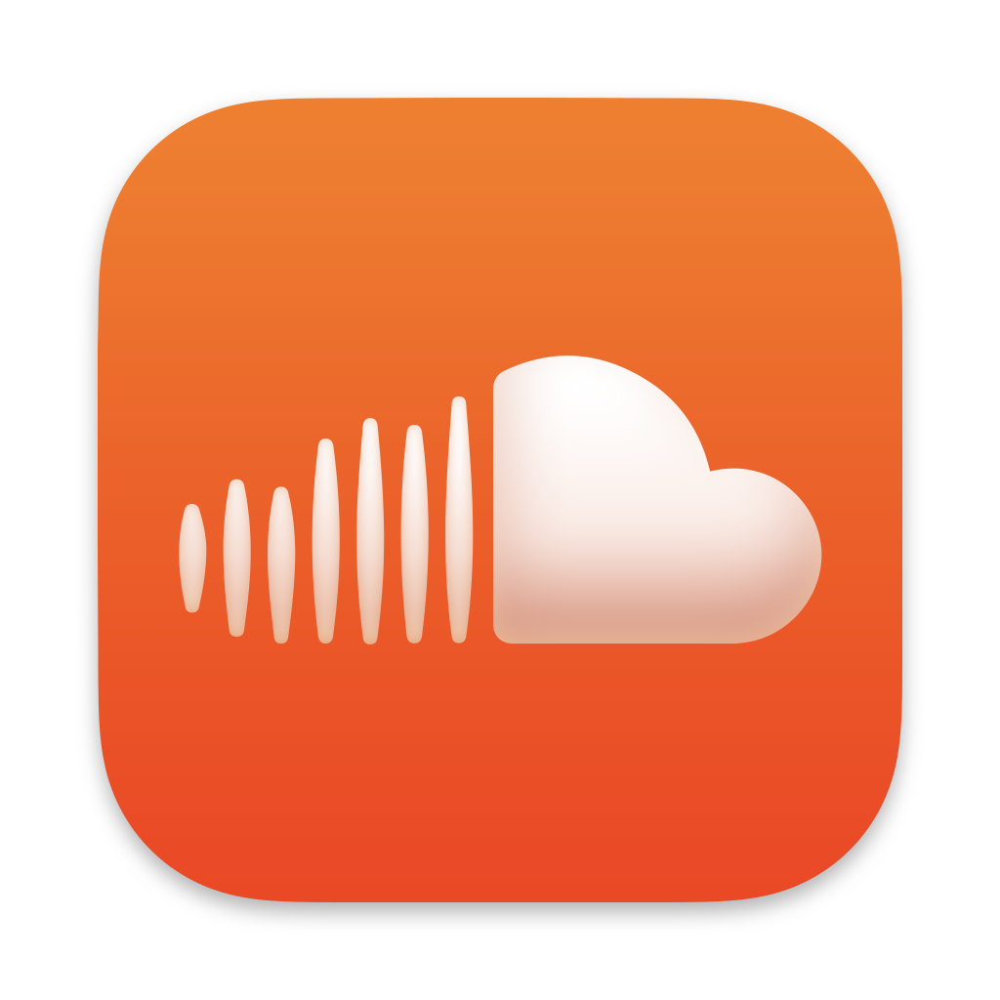
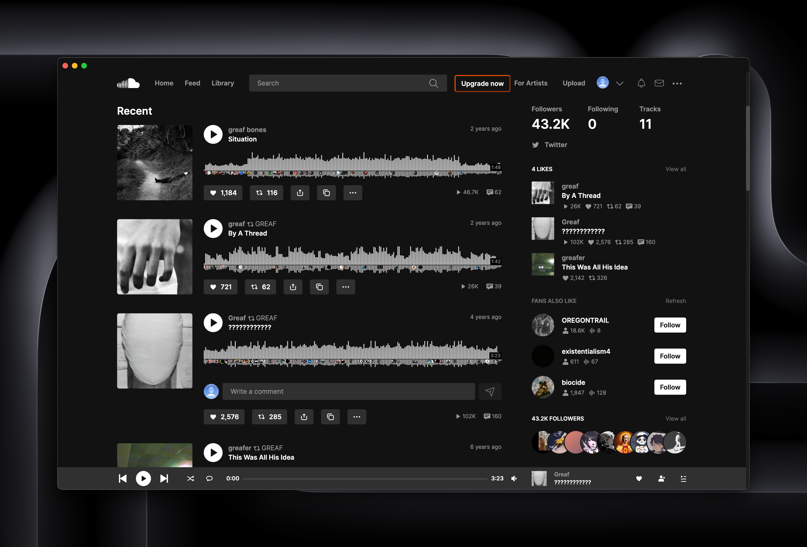
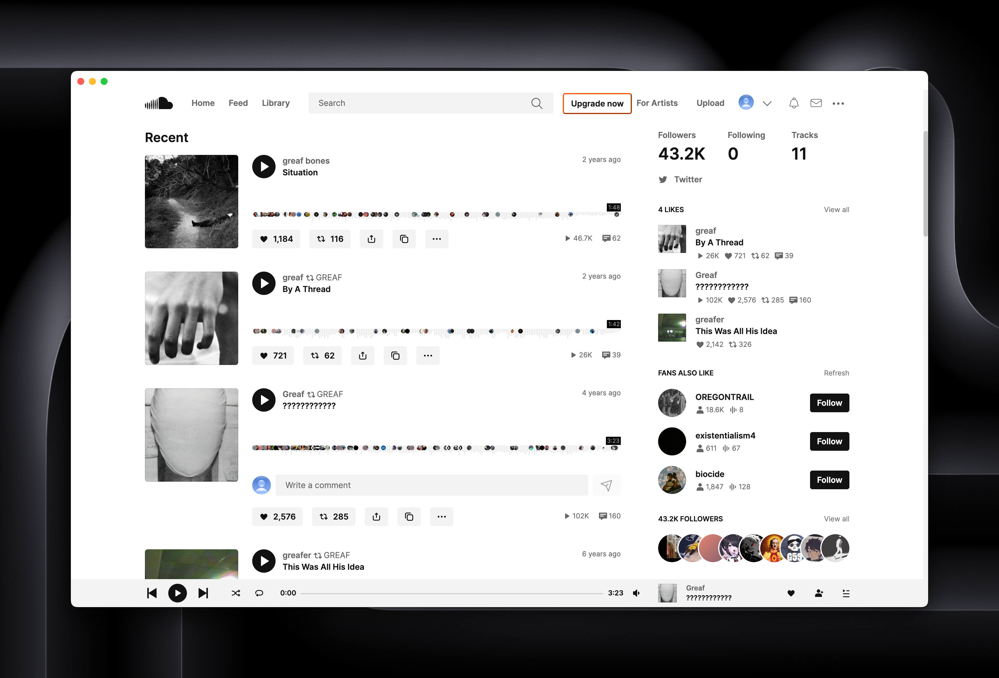

<div align="center">

<picture>
      
</picture>

# soundcloud-rpc

A **SoundCloud** Client with **Discord Rich Presence**, **Dark Mode**, **Last.fm** and **AdBlock** support

</div>

## ⚡️ Quick start

For the latest version of soundcloud-rpc, download the installer or executable file from the
[latest release](https://github.com/richardhbtz/soundcloud-rpc/releases) page.

> [!NOTE]
>
> ### macOS Users
>
> If you encounter a "Damaged App" popup after installation, run the following command in the terminal to resolve the
> issue:
>
> ```
> xattr -dr com.apple.quarantine /Applications/soundcloud.app
> ```
>
> After running this command, the app should launch without any problem.

## ⚙️‍ Building

Before installing and running this app, you must have [Node.js](https://nodejs.org/) installed on your machine.

1. Clone this repository to your local machine
2. Run `npm install` to install the required dependencies.
3. Run `npm build` to build the application.

## 📖 Usage

Press `F1` to open the application menu, which provides access to various settings and features.

### Keyboard Shortcuts

**Quick Reference:**

- **F1** - Open Settings
- **Ctrl/Cmd + R** - Refresh the current page
- **Ctrl/Cmd + B** - Go back to the previous page
- **Ctrl/Cmd + F** - Go forward to the next page
- **Ctrl/Cmd + =** - Zoom in
- **Ctrl/Cmd + -** - Zoom out
- **Ctrl/Cmd + 0** - Reset zoom

## 🖼️ Preview

<div align="center">
<picture>
      
</picture>

<picture>
      
</picture>
</div>

## 🛠️ Built With

- [@xhayper/discord-rpc](https://www.npmjs.com/package/@xhayper/discord-rpc) - Discord Rich Presence integration
- [Electron](https://www.electronjs.org/) - Framework for building cross-platform desktop applications
- [electron-builder](https://www.electron.build/) - Tool for packaging and distributing Electron applications
- [@ghostery/adblocker-electron](https://www.npmjs.com/package/@ghostery/adblocker-electron) - Ad blocking functionality
- [electron-store](https://www.npmjs.com/package/electron-store) - Data persistence
- [electron-updater](https://www.npmjs.com/package/electron-updater) - Auto-update functionality

## 🤝 Contributing

Contributions to this project are welcome. If you find a bug or would like to suggest a new feature, please open an
issue on this repository.

## 📜 License

This project is licensed under the MIT License. See the [LICENSE](./LICENSE) file for details.

[repo_logo_img]: https://github.com/create-go-app/cli/assets/11155743/95024afc-5e3b-4d6f-8c9c-5daaa51d080d
[repo_url]: https://github.com/richardhbtz/soundcloud-rpc
