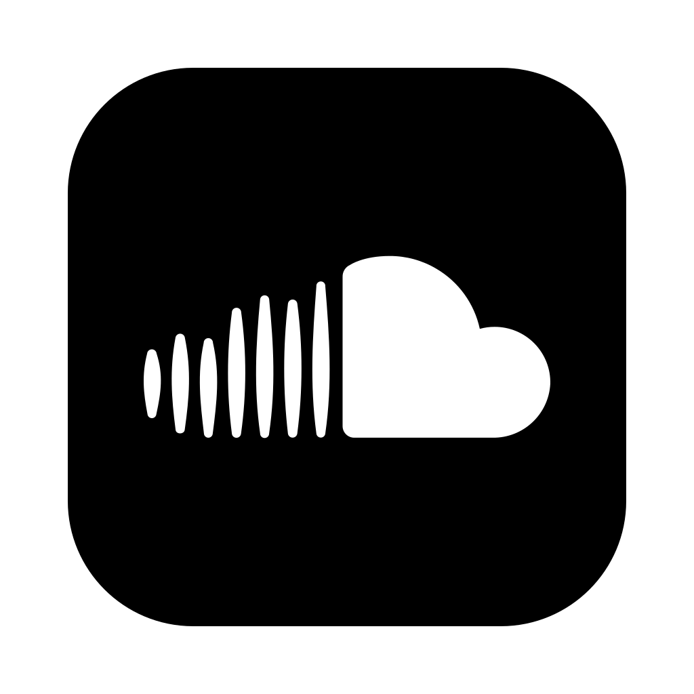
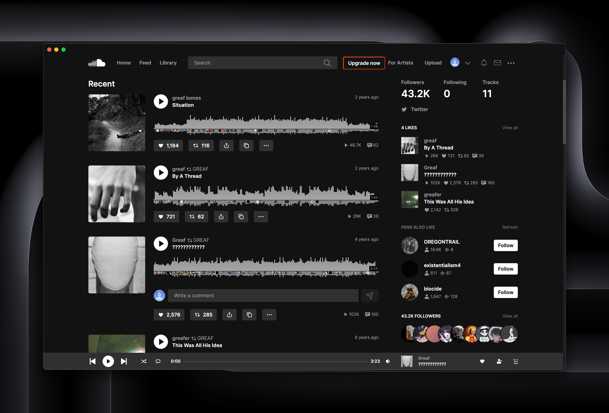

<div align="center">



# sc-desktop

A desktop app for SoundCloud, for macOS, Windows and Linux.

</div>

This started as a fork of [richardhbtz/soundcloud-rpc](https://github.com/richardhbtz/soundcloud-rpc) and has changed
enough since that it now lives on its own.



## What it does

- Tabs, with an address bar in the active tab
- Downloads tracks, albums and playlists through [yt-dlp](https://github.com/yt-dlp/yt-dlp)
- Discord Rich Presence, Last.fm scrobbling and webhooks
- Ad blocking, and hides SoundCloud's own promos and Go+ upsells
- Dark mode, [custom themes](docs/CUSTOM_THEMES.md) and [plugins](docs/PLUGINS.md)
- More than one account, each with its own session
- Go+ playback
- Swipe to go back and forward on macOS
- Proxy support

## Install

Download a build from the [releases](https://github.com/elricfd/sc-desktop/releases) page.

On macOS, if the app is reported as damaged, clear the quarantine flag:

```bash
xattr -dr com.apple.quarantine /Applications/SoundCloud.app
```

On Linux, make the AppImage executable and run it. It writes its own desktop entry and icon on first launch, and it is
the only Linux build that updates itself. The tray works out of the box on KDE; GNOME needs a tray extension.

```bash
chmod +x soundcloud-*-linux.AppImage
./soundcloud-*-linux.AppImage
```

Downloading needs yt-dlp installed (`brew install yt-dlp`, `winget install yt-dlp` or `pip install yt-dlp`), and ffmpeg
for most tracks. If the app can't find yt-dlp, set its path in Settings.

## Shortcuts

Settings are behind the menu button at the top right.

| Key                                | Action                  |
| ---------------------------------- | ----------------------- |
| `F1`                               | Settings                |
| `Ctrl/Cmd + T`                     | New tab                 |
| `Ctrl/Cmd + W`                     | Close tab               |
| `Ctrl + Tab`, `Ctrl + Shift + Tab` | Next and previous tab   |
| `Ctrl/Cmd + L`                     | Edit the address        |
| `Ctrl/Cmd + R`                     | Reload                  |
| `Ctrl/Cmd + B`                     | Back                    |
| `Ctrl/Cmd + F`                     | Forward                 |
| `Ctrl/Cmd + =`, `-`, `0`           | Zoom in, out, and reset |

## Building

You need [Node.js](https://nodejs.org/).

```bash
npm install
npm run dev          # run from source
npm run build-mac    # or build-win, build-linux-appimage, build-linux-deb
```

`npm test` runs the tests and `npm run lint` runs ESLint.

### Go and Go+ tracks

Go and Go+ tracks are DRM-protected and play through Widevine. On macOS and Windows that only works in a build that has
been VMP-signed by castlabs. An unsigned build still starts and plays free tracks, but Go+ tracks stall or skip without
any error, so check this first if paid tracks won't play.

Signing is free. Create a castlabs EVS account once, then build with the credentials set:

```bash
pip install --upgrade castlabs-evs
python -m castlabs_evs.account signup

EVS_USERNAME=you EVS_PASSWORD=secret npm run build-mac
```

Set `STRICT_VMP_SIGNING=true` to make the build fail when signing doesn't succeed, instead of only warning. Linux builds
don't need signing.

## Credits

Based on [soundcloud-rpc](https://github.com/richardhbtz/soundcloud-rpc) by Richard Habitzreuter. The playback speed
plugin is a port from [SoundCloud Desktop](https://github.com/zxcloli666/SoundCloud-Desktop).

## License

[MIT](./LICENSE)
