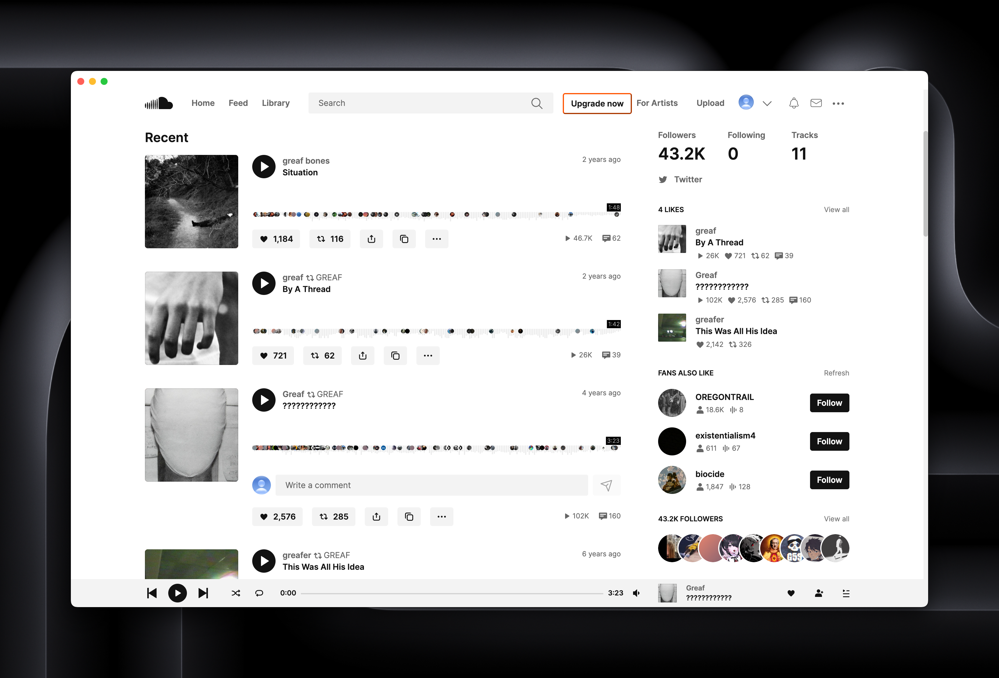

<div align="center">

<picture>
      
</picture>

# soundcloud-rpc

A **SoundCloud** Client with **Discord Rich Presence**, **Dark Mode**, **Last.fm** and **AdBlock** support

Works on **Linux** (AppImage/deb/tar.gz), **Windows** and **macOS**

</div>

## ⚡️ Quick start

For the latest version of soundcloud-rpc, download the installer or executable file from the
[latest release](https://github.com/richardhbtz/soundcloud-rpc/releases) page.

> [!NOTE]
>
> ### macOS Users
>
> If you encounter a "Damaged App" popup after installation, run the following command in the terminal to resolve the
> issue:
>
> ```
> xattr -dr com.apple.quarantine /Applications/soundcloud.app
> ```
>
> After running this command, the app should launch without any problem.

## 🐧 Linux

Grab the AppImage, deb or tar.gz from the [releases](https://github.com/richardhbtz/soundcloud-rpc/releases) page.

```
chmod +x soundcloud-*-linux.AppImage
./soundcloud-*-linux.AppImage
```

The AppImage writes its own .desktop file + icon on first run, so the proper icon shows up in the taskbar/launcher from
the second launch on (wayland compositors can't know the icon before that). Auto updates only work with the AppImage. If
your distro doesn't ship FUSE 2 (Arch and Ubuntu 24.04 don't), install it or start the AppImage with
`--appimage-extract-and-run`; the tar.gz needs nothing at all, just unpack it and run `soundcloud-rpc`.

**GO+ playback works.** Streaming only ever needs temporary Widevine licenses, and Linux grants those: EME returns
`com.widevine.alpha` at `SW_SECURE_CRYPTO` robustness with `sessionTypes: ["temporary"]`. Only _persistent_ (offline)
licenses are refused — the limitation Linux was dropped over — and those are being retired everywhere anyway, deprecated
in castlabs ECS v38 and removed in v42. Linux's Widevine has no VMP, so there is nothing to sign here. The CDM downloads
itself on first launch, so the very first start needs a connection.

Media keys and the desktop's "now playing" widget go through MPRIS, which the app registers as
`org.mpris.MediaPlayer2.chromium.instance<pid>`. The tray needs a StatusNotifierItem host: KDE has one built in, GNOME
needs a systray extension, and bars like waybar or quickshell need their tray module enabled.

Chromium needs either unprivileged user namespaces or a setuid `chrome-sandbox` helper, and an AppImage can't have the
latter because it's mounted `nosuid`. On distros that also lock down unprivileged namespaces (Ubuntu 24.04+, hardened
Debian kernels) the app detects the dead end and falls back to `--no-sandbox` instead of refusing to launch. The deb
installs the setuid helper, so it keeps the sandbox on those systems.

Or build it yourself:

```
npm install
npm run build-linux            # AppImage + deb + tar.gz
npm run build-linux-appimage   # or build-linux-deb / build-linux-tar
```

## ⚙️‍ Building

Before installing and running this app, you must have [Node.js](https://nodejs.org/) installed on your machine.

1. Clone this repository to your local machine
2. Run `npm install` to install the required dependencies.
3. Run `npm build` to build the application.

## 📖 Usage

Press `F1` to open the application menu, which provides access to various settings and features.

### Keyboard Shortcuts

**Quick Reference:**

- **F1** - Open Settings
- **Ctrl/Cmd + R** - Refresh the current page
- **Ctrl/Cmd + B** - Go back to the previous page
- **Ctrl/Cmd + F** - Go forward to the next page
- **Ctrl/Cmd + =** - Zoom in
- **Ctrl/Cmd + -** - Zoom out
- **Ctrl/Cmd + 0** - Reset zoom

## 🖼️ Preview

<div align="center">
<picture>
      
</picture>

<picture>
      
</picture>
</div>

## 🛠️ Built With

- [@xhayper/discord-rpc](https://www.npmjs.com/package/@xhayper/discord-rpc) - Discord Rich Presence integration
- [Electron](https://www.electronjs.org/) - Framework for building cross-platform desktop applications
- [electron-builder](https://www.electron.build/) - Tool for packaging and distributing Electron applications
- [@ghostery/adblocker-electron](https://www.npmjs.com/package/@ghostery/adblocker-electron) - Ad blocking functionality
- [electron-store](https://www.npmjs.com/package/electron-store) - Data persistence
- [electron-updater](https://www.npmjs.com/package/electron-updater) - Auto-update functionality

## 🤝 Contributing

Contributions to this project are welcome. If you find a bug or would like to suggest a new feature, please open an
issue on this repository.

## 📜 License

This project is licensed under the MIT License. See the [LICENSE](./LICENSE) file for details.

[repo_logo_img]: https://github.com/create-go-app/cli/assets/11155743/95024afc-5e3b-4d6f-8c9c-5daaa51d080d
[repo_url]: https://github.com/richardhbtz/soundcloud-rpc
